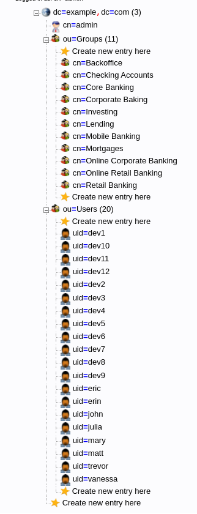
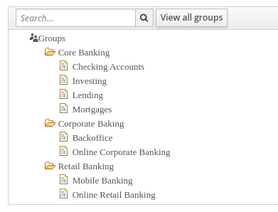
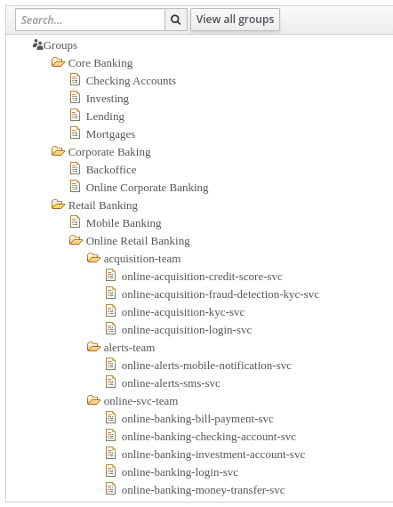

= Credit

The original content is from https://github.com/raffaelespazzoli/orgs-management-ocp[raffaelespazzoli] and https://www.openshift.com/blog/orgs-management-and-team-onboarding-in-openshift-a-fully-automated-approach[blog].

# Known Issue

* PHP LDAP admin UI is not working

# Team Onboarding Demo for OpenShift

This demo helps to setup KeyCloak as an OpenID Connect identity for OpenShift. KeyCloak is using OpenLDAP as an identity provider. 

1. Mapping of the corporate organization to OpenShift RBAC model. 
2. synchronization of groups. This is going to be addressed with the group-sync-operator in this demo.

## Demo Scenario

A corporate LDAP container the org hierarchy with the following levels: LOB, BU. Informal levels that are not mapped in the corporate LDAP are dev team and application.

## LDAP installation

```shell
oc new-project ldap
oc adm policy add-scc-to-user anyuid -z default -n ldap
oc apply -f ./ldap -n ldap
```

After this step you should be able to connect to the ldap admin UI:

```shell
echo https://$(oc get route ldap-admin -n ldap -o jsonpath='{.spec.host}')
```

with "cn=admin,dc=example,dc=com"/admin credentials.

If data has been loaded correctly you should see this situation:



This represents the situation we might find in a enterprise LDAP and is the starting point of our demo.

all users with a person's name have `admin` assigned as password.
all users that start with `dev` have `dev` as password.

## Keycloak Installation

```shell
oc new-project keycloak-operator
oc apply -f ./keycloak/operator.yaml -n keycloak-operator
oc apply -f ./keycloak/keycloak.yaml -n keycloak-operator
oc create route reencrypt keycloak --port 8443 --service keycloak -n keycloak-operator
```

## Keycloak - LDAP Integration

Wait for Red Hat SSO pod to be up and running first.

```shell
export admin_password=$(oc get secret credential-ocp-keycloak -n keycloak-operator -o jsonpath='{.data.ADMIN_PASSWORD}' | base64 -d)
oc exec -n keycloak-operator keycloak-0 -- /opt/jboss/keycloak/bin/kcadm.sh config credentials --server http://localhost:8080/auth --realm master --user admin --password ${admin_password} --config /tmp/kcadm.config
export ldap_integration_id=$(cat ./keycloak/ldap-federation.json | envsubst | oc exec -i -n keycloak-operator keycloak-0 -- /opt/jboss/keycloak/bin/kcadm.sh create components --config /tmp/kcadm.config -r ocp -f - -i)
echo created ldap integration $ldap_integration_id
cat ./keycloak/role-mapper.json | envsubst | oc exec -i -n keycloak-operator keycloak-0 -- /opt/jboss/keycloak/bin/kcadm.sh create components --config /tmp/kcadm.config -r ocp -f -
```

After this step, you should be able to login Keycloak

```shell
echo https://$(oc get route keycloak -n keycloak-operator -o jsonpath='{.spec.host}')
echo admin/${admin_password}
```

and you should see the following groups



It may take about 5 minutes for the groups to fully synchronize. Otherwise login to SSO and go to User Federation -> Ocp-ldap-provider -> synchronize all users.

## Keycloak Group Augmentation

In this section we emulate org owners that connect to Keycloak and organizes their portion of the organization hierarchy by adding the dev team and application layers.

```shell
./keycloak/group-config.sh
```

this command will take a while. After executing it, you should see the following:



## OCP - Keycloak integration

```shell
export keycloak_route=$(oc get route keycloak -n keycloak-operator -o jsonpath='{.spec.host}')
export auth_callback=$(oc get route oauth-openshift -n openshift-authentication -o jsonpath='{.spec.host}')/oauth2callback
cat ./ocp-auth/keycloak-client.yaml | envsubst | oc apply -f - -n keycloak-operator
oc apply -f ./ocp-auth/secret.yaml

# This assumes RHPDS with Let's Encrypt. Modify accordingly. 
ca_secret=$(oc get ingresscontroller.operator default -n openshift-ingress-operator -o jsonpath='{.spec.defaultCertificate.name}')
oc get secrets -n openshift-ingress $ca_secret -o jsonpath='{.data.tls\.crt}' | base64 -d > /tmp/ca.crt
oc -n openshift-config create configmap ocp-ca-bundle --from-file=/tmp/ca.crt

export oauth_patch=$(cat ./ocp-auth/oauth.yaml | envsubst | yq eval -j)
oc patch OAuth.config.openshift.io cluster -p '[{"op": "add", "path": "/spec/identityProviders/-", "value": '"${oauth_patch}"' }]' --type json
```

## OCP - Keycloak Group Sync

### Deploy the group sync operator

```shell
oc new-project group-sync-operator
oc apply -f ./group-sync/operator.yaml -n group-sync-operator
```

### Deploy group sync logic

```shell
export keycloak_route=$(oc get route keycloak -n keycloak-operator -o jsonpath='{.spec.host}')
export admin_password=$(oc get secret credential-ocp-keycloak -n keycloak-operator -o jsonpath='{.data.ADMIN_PASSWORD}' | base64 -d)
oc create secret generic keycloak-group-sync --from-literal=username=admin --from-literal=password=${admin_password} -n group-sync-operator
cat ./group-sync/groupsync.yaml | envsubst | oc apply -f -
```
After syncing you should see the following situation:

```shell
oc get groups
NAME                                         USERS
Backoffice                                   erin
Checking Accounts                            vanessa
Core Banking                                 matt, mary, julia, vanessa
Corporate Baking                             erin, eric
Investing                                    matt
Lending                                      mary
Mobile Banking                               john
Mortgages                                    julia
Online Corporate Banking                     eric
Online Retail Banking                        dev6, trevor, dev2, dev4, dev8, dev11, dev5, dev1, dev9, dev3, dev7, dev10, dev12
Retail Banking                               dev6, trevor, dev2, dev4, dev8, dev11, dev5, dev1, dev9, dev3, dev7, dev10, dev12, john
acquisition-team                             dev6, dev7, dev8, dev9
alerts-team                                  dev11, dev10
online-acquisition-credit-score-svc          dev8
online-acquisition-fraud-detection-kyc-svc   dev9
online-acquisition-kyc-svc                   dev7
online-acquisition-login-svc                 dev6
online-alerts-mobile-notification-svc        dev11
online-alerts-sms-svc                        dev10
online-banking-bill-payment-svc              dev4
online-banking-checking-account-svc          dev2
online-banking-investment-account-svc        dev3
online-banking-login-svc                     dev1
online-banking-money-transfer-svc            dev5
online-svc-team                              dev5, dev4, dev2, dev3, dev1
```

# Notes

* There are no projects created for the users 
* Users will not be create any project if the link:../rbac/README.adoc[rbac] demo was ran earlier. 