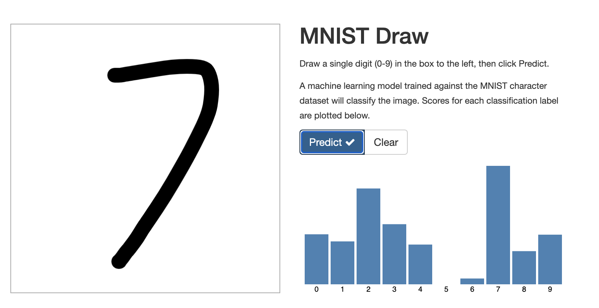

= Introduction

This demostrate the usage of NGINX Ingress Controller for Kubernetes on OpenShift.

== Setup

To create the NGINX Operator in the `nginx-demo` project:
[source, bash]
----
$ oc create -f nginx-proj.yaml
$ oc create -f nginx-og.yaml
$ oc create -f nginx-sub.yaml
$ oc create -f nginx-ingress-controller.yaml
----

This will deploy NGINX with the `serviceType: LoadBalancer`.

To get the ELB hostname:
[source, bash]
----
$ oc get svc my-nginx-ingress-controller -n nginx-demo -o jsonpath='{.status.loadBalancer.ingress[0].hostname}'; echo
----

Curl the hostname to ensure that nginx is working.
[source, bash]
----
$ curl http://<hostname>
<html>
<head><title>404 Not Found</title></head>
<body>

<h1>404 Not Found</h1>

nginx/1.19.6

</body>
</html>
----

== Deploy sample app

We will deploy a sample https://github.com/tsailiming/s2i-python-pytorch[MNIST] application to draw and classify digits (0-9). 

=== Customization

The `mmist.yaml` deployment files depends on 2 hostnames:

- mnist-flask.demo.ltsai.com
- mnist-draw.demo.ltsai.com

You should probably change this to your own and map the ELB hostname to these names. 

[source, bash]
----
$ host mnist-flask.demo.ltsai.com
mnist-flask.demo.ltsai.com is an alias for aaad2b27d94c44641aa0551504dd8b2c-2107951604.ap-southeast-1.elb.amazonaws.com.
aaad2b27d94c44641aa0551504dd8b2c-2107951604.ap-southeast-1.elb.amazonaws.com has address 52.220.230.6
aaad2b27d94c44641aa0551504dd8b2c-2107951604.ap-southeast-1.elb.amazonaws.com has address 54.179.123.120
aaad2b27d94c44641aa0551504dd8b2c-2107951604.ap-southeast-1.elb.amazonaws.com has address 18.136.149.46

$ host mnist-draw.demo.ltsai.com
mnist-draw.demo.ltsai.com is an alias for aaad2b27d94c44641aa0551504dd8b2c-2107951604.ap-southeast-1.elb.amazonaws.com.
aaad2b27d94c44641aa0551504dd8b2c-2107951604.ap-southeast-1.elb.amazonaws.com has address 52.220.230.6
aaad2b27d94c44641aa0551504dd8b2c-2107951604.ap-southeast-1.elb.amazonaws.com has address 54.179.123.120
aaad2b27d94c44641aa0551504dd8b2c-2107951604.ap-southeast-1.elb.amazonaws.com has address 18.136.149.46
----

=== Deploy the app
Deploy the app and test the app to ensure is using NGINX. 

[source, bash]
----
$ oc create -f mnist.yaml

$ curl -v http://mnist-draw.demo.ltsai.com/
*   Trying 54.179.123.120:80...
* Connected to mnist-draw.demo.ltsai.com (54.179.123.120) port 80 (#0)
> GET / HTTP/1.1
> Host: mnist-draw.demo.ltsai.com
> User-Agent: curl/7.75.0
> Accept: */*
> 
* Mark bundle as not supporting multiuse
< HTTP/1.1 200 OK
< Server: nginx/1.19.6
< Date: Sun, 14 Mar 2021 11:43:12 GMT
< Content-Type: text/html; charset=utf-8
< Content-Length: 2227
< Connection: keep-alive
< X-Powered-By: Express
< ETag: W/"8b3-aeROoJJ5IElCRwtF3E3MgTWZmmA"
----

